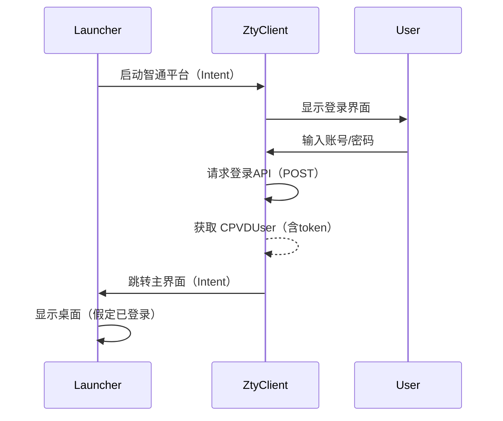
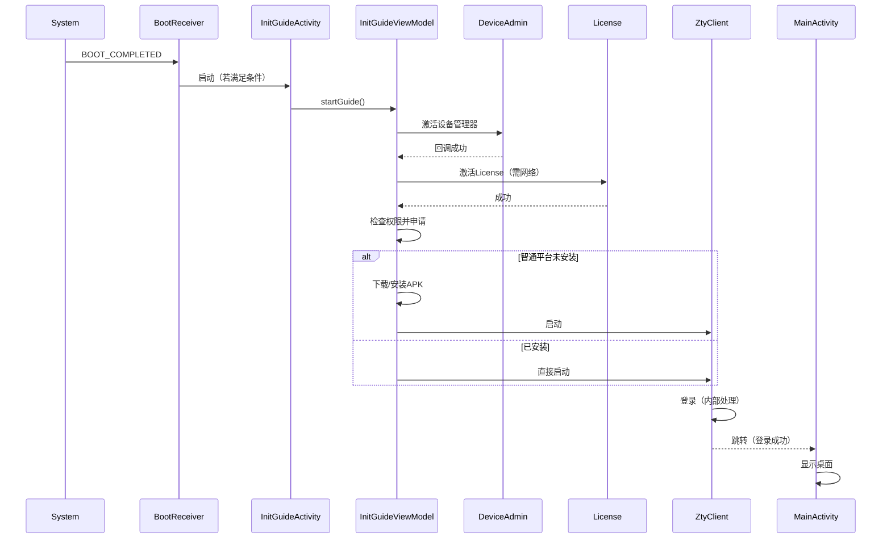

# 学海启动器（XueHai Launcher）流程分析

> 基于源码深度逆向的完整流程解析，涵盖引导、登录、权限、自启、退出机制等核心逻辑。

---

## 📌 项目概述

**学海启动器** 是一款专为教育场景定制的 Android 桌面应用（Launcher），主要服务于“学海/智通云”生态。其核心职责是：

- 完成设备初始化（设备管理员、License、权限）
- 下载并安装核心业务应用 **智通平台（ZtyClient）**
- 提供桌面图标展示与启动
- 与应用锁、应用管理等功能联动

**登录业务完全由智通平台独立处理**，启动器不涉及任何账号密码或 token 的请求。

---

## 🔐 登录流程（由智通平台负责）

启动器本身 **不发起任何登录请求**，登录流程完全委托给第三方应用 **智通平台（com.xh.zhitongyunstu）**。

### 关键说明
- 登录请求使用独立的网络库（推测为 `HttpRequest` 或 OkHttp），参数包括 `username`、`password`、`deviceId` 等。
- 登录成功后返回 `CPVDUser` 对象（含 `accessToken`、`userId`、`schoolId` 等），由智通平台存储。
- **启动器不保存任何登录态**，仅通过智通平台广播或 Intent 获取状态。

---

## 🚀 完整启动流程（从开机到桌面）

启动器通过 `BootReceiver` 监听开机广播，触发自启流程，随后进入引导状态机。

### 1. 开机自启（BootReceiver）
- 监听 `BOOT_COMPLETED`、`LOCKED_BOOT_COMPLETED`、`USER_UNLOCKED`。
- 满足条件（已激活且为默认桌面）时，自动启动启动器。

### 2. 引导页（InitGuideActivity）
引导页按顺序执行以下步骤，每一步成功后才进入下一步，失败则显示重试或跳转安全模式。

| 步骤 | 方法 | 说明 |
|------|------|------|
| ① | `continueToGuide` | 入口，检查前置条件（系统定制、权限） |
| ② | `activateDeviceManager` | 激活设备管理员（DeviceAdmin），用户手动确认 |
| ③ | `activateLicense` | 激活 SDK License（需网络） |
| ④ | `doLast` | 最终准备（权限检查、智通平台安装与启动） |

### 3. 智通平台安装与启动（doLast）
- 检查使用情况权限（`PACKAGE_USAGE_STATS`）和写入设置权限（`WRITE_SETTINGS`）。
- 检查运行时权限（`WRITE_EXTERNAL_STORAGE`、`READ_PHONE_STATE`）。
- 若智通平台未安装：
  - 调用 `NetStore.checkDevice()` 校验设备合法性（若非法则拒绝安装）。
  - 下载 APK（在线/离线），进度反馈。
  - 静默安装（通过 `AppInstallManager`），安装完成后延迟启动。
- 若已安装：直接启动智通平台。

### 4. 主界面（MainActivity）
- 启动时直接显示桌面（`showNormalMode`），不做任何登录校验。
- 桌面图标通过 `ApplicationManager` 缓存和管理。
- 监听应用安装/卸载，动态刷新桌面。

### 完整时序图（Mermaid）

---

## 🔄 退出与卸载机制分析

### 能否退出自身？

**一般情况下不允许**：
- 返回键（`KEYCODE_BACK`）被拦截，无法退出。
- 无任何菜单或按钮提供退出功能。

**仅有的两个退出场景**（均发生在引导阶段）：

| 场景 | 触发条件 | 行为 |
|------|----------|------|
| 非定制系统警告 | 系统版本不在白名单，用户点击“取消” | `finish()` + `killProcess()` |
| 系统异常弹窗 | 特定机型（SM-P620）且系统非定制，用户点击“确定” | 同上 |

> ⚠️ 即使进程结束，**默认桌面设置仍然保留**，重启后启动器仍会自动拉起。

### 能否卸载自身？

- **没有主动卸载自身的代码**（如 `ACTION_UNINSTALL_PACKAGE`）。
- `AppManager.uninstall()` 仅用于卸载其他应用，且通过广播委托给智通平台。
- 用户只能通过 **系统设置 → 应用** 手动卸载，或清除默认桌面设置。

---

## 🛡️ 安全与监测机制

启动器内置多项监测，但主要用于异常防护，不用于退出：

- **`SettingSafeGuard`**：监控权限设置页面停留，超时则提示并可能跳转安全模式。
- **`CrashLevelManager`**：记录严重崩溃次数，达到阈值后进入安全模式（`SafeActivity`）。
- **`DeviceChecker`**：设备安全检测，异常时可能中断引导。

---

## 🧩 关键类与职责速查

| 类名 | 职责 |
|------|------|
| `BootReceiver` | 开机自启 |
| `InitGuideActivity` | 引导页 UI，观察 ViewModel |
| `InitGuideViewModel` | 引导状态机（设备管理员、License、权限、智通平台安装） |
| `MainActivity` | 主界面，显示桌面 |
| `MainViewModel` | 桌面加载，应用更新监听 |
| `ApplicationManager` | 桌面图标缓存与加载 |
| `SessionData` | 运行时状态（网络、版本有效性等） |
| `NetworkManger` | 网络状态监听 |
| `RequestHelper` | 网络请求入口（用于业务接口，如设备校验） |
| `AppLockManager` | 应用锁判断与跳转（委托智通平台） |
| `AppManager` | 应用安装/卸载（通过广播委托） |
| `SafeActivity` | 安全模式（当引导失败或崩溃时） |

---

## 📦 技术栈摘要

- **语言**：Kotlin + Java 混合
- **网络层**：自定义 `LRequest` 体系（基于 OkHttp）+ JNI 网络库（`HttpRequest`）
- **异步**：协程（`kotlinx.coroutines`）、RxJava
- **UI**：`AppCompatActivity`、沉浸式状态栏、自定义 `LoadingView`
- **数据存储**：`SharedPreferences`（`LauncherSPUtil`、`XHSPUtil`）
- **设备管理**：`DeviceAdminReceiver`、`UserManager`、`PackageManager`

---

## 🔍 总结

- **登录由智通平台全权负责**，启动器不做任何登录请求。
- **启动流程** 为强引导型，必须按顺序完成设备激活、License 激活、权限申请和智通平台安装，否则无法进入桌面。
- **退出/卸载** 基本被屏蔽，仅在极少数异常场景允许进程结束，但默认桌面设置仍保留。
- **监测机制** 侧重于安全防护，不涉及用户隐私收集。

> 该设计体现了教育场景下对设备管控的严格要求，适合定制化 ROM 或企业级部署环境。

---

*文档基于源码逆向分析，仅供学习参考。*
